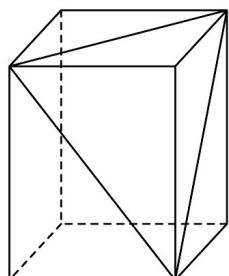
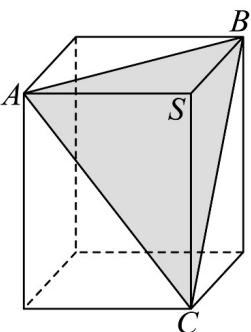

> [!faq]- 《专题02 棱柱、棱锥、棱台表面积与体积的六大常考题型（高效培优专项训练）》官方解析
>
> > [!success]- **【答案】**  A.3 B.5 C.6 D.8
>
> > [!note]- **【分析】**
> > 设长方体的长、宽、高分别为 $a, b, c$ ，根据长方体的几何特征，我们可得 $SA, SB, SC$ 两两垂直，代入棱锥体积公式及长方体体积公式，求出三棱锥的体积与剩下的几何体体积，进而得到答案。
>
> > [!note]- **【解析】**
> > 
> >
> > 设长方体的长、宽、高分别为 a, b, c，易知长方体的体积为 abc。
> >
> > 不妨令 SA = a, SB = b, SC = c.
> >
> > 由长方体，易知 $SA, SB, SC$ 两两垂直，
> >
> > 所以 $V_{A - SBC} = \frac{1}{3} SA\cdot S_{\triangle SBC} = \frac{1}{3} a\times \frac{1}{2} bc = \frac{1}{6} abc$
> >
> > 于是 $V_{S-ABC} = V_{A-SBC} = \frac{1}{6} abc$
> >
> > 故剩下几何体的体积 $V = abc - \frac{1}{6} abc = \frac{5}{6} abc$
> >
> > 因此， $V:V_{S - ABC} = 5$
> >
> > 故选 **B**.
