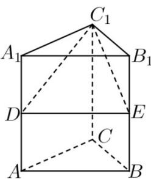
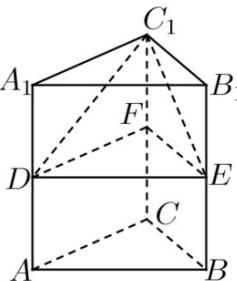

> [!faq]- 《专题02 棱柱、棱锥、棱台表面积与体积的六大常考题型（高效培优专项训练）》官方解析
>
> > [!success]- **【答案】**  A. $V_{1} = \frac{1}{3} V_{2}$ B. $V_{1} = \frac{1}{6} V_{2}$ C. $V_{1} = \frac{1}{4} V_{2}$ D. $V_{1} = \frac{3}{8} V_{2}$
>
> > [!note]- **【分析】**
> > 根据棱锥与棱柱的体积公式，结合图形，可得答案.
>
> > [!note]- **【解析】**
> > 取 $CC_{1}$ 的中点为F，连接DF,EF，如下图：
> >
> > 
> >
> > 易知三棱柱 $A_{1}B_{1}C_{1} - DEF$ 的体积是三棱柱 $A_{1}B_{1}C_{1} - ABC$ 的一半，由图可知三棱锥 $C_{1} - DEF$ 与三棱柱 $A_{1}B_{1}C_{1} - DEF$ 同底等高，则三棱锥 $C_{1} - DEF$ 的体积是三棱柱 $A_{1}B_{1}C_{1} - DEF$ 体积的三分之一，即四棱锥 $C_{1} - A_{1}DEB_{1}$ 的体积是三棱柱 $A_{1}B_{1}C_{1} - DEF$ 体积的三分之二，综上可得四棱锥 $C_{1} - A_{1}DEB_{1}$ 的体积是三棱柱 $A_{1}B_{1}C_{1} - ABC$ 的三分之一，
> >
> > $$
> > V _ {1} = \frac {1}{3} V _ {2}
> > $$
> >
> > 故选 **A**.
