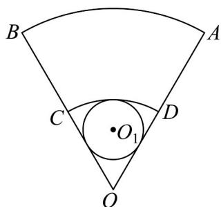

<!-- question-source:start -->
25．如图，一块扇形铁皮 $AOB$ ，半径 $OA = 36$ 厘米，圆心角 $\angle AOB = \frac{\pi}{3}$ ，现剪下一个扇环 $ABCD$ 做圆台形容器的侧面，并从剩余的扇形 $COD$ 内剪下一个最大的圆刚好做容器的下底（圆台下底面大于上底面）.

(1) $OC$ 应取多少厘米？

(2)制作这样一个没有上底的圆台形容器需要多少平方厘米的铁皮？（不计连接处损耗）
<!-- question-source:end -->

![[高中/课堂同步/题库/人教A版高中数学同步讲义(2026)/02_必修第二册/第八章 立体几何初步/专题03 圆柱、圆锥、圆台及球表面积与体积的五大常考题型（高效培优专项训练）/题型三_圆台表面积与体积/questions/answers/Q00069617A1.md]]
