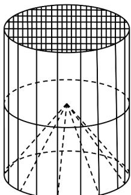

<!-- question-source:start -->
18．某种“笼具”由内，外两层组成，无下底面，内层和外层分别是一个圆锥和圆柱，其中圆柱与圆锥的底面相同，圆柱有上底面，制作时需要将圆锥的顶端剪去，剪去部分和接头忽略不计。已知圆柱的底面周长为 $32\pi \mathrm{cm}$ ，高为 $30\mathrm{cm}$ ，圆锥的母线长为 $20\mathrm{cm}$ 。

(1)求这种“笼具”的体积；

(2)现用 $30720\pi \mathrm{cm}^2$ 的纱网材料制作这种“笼具”，问可以制作多少个“笼具”？
<!-- question-source:end -->

![[高中/课堂同步/题库/人教A版高中数学同步讲义(2026)/02_必修第二册/第八章 立体几何初步/专题03 圆柱、圆锥、圆台及球表面积与体积的五大常考题型（高效培优专项训练）/题型二_圆锥表面积与体积/questions/answers/Q00069611A1.md]]
