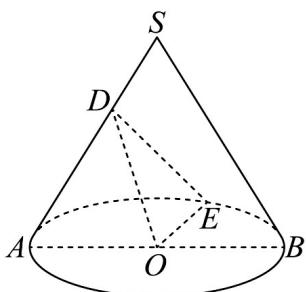
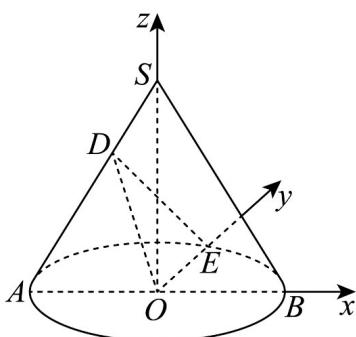

> [!faq]- 《专题03 圆柱、圆锥、圆台及球表面积与体积的五大常考题型（高效培优专项训练）》官方解析
>
> > [!success]- **【答案】**  A. 圆锥 $SO$ 的侧面积为 $6\pi$ B. $SB \parallel$ 平面 $ODE$ C. 直线 $DE, SB$ 所成角的余弦值为 $\frac{7\sqrt{22}}{44}$ D. 点 $_{\mathrm{S}}$ 到平面 $ODE$ 的距离为 $\frac{3\sqrt{7}}{7}$
>
> > [!note]- **【分析】**
> > 设圆锥 SO 的高为 h，底面圆半径为 r，结合体积 $V = \frac{1}{3} \pi r^{2} h = 3 \pi$ ，则可求得 $r = \sqrt{3}, h = 3$ ，即可对 A 判断；建立空间直角坐标系，利用向量法证明线面平行，即可对 B 判断；利用异面直线夹角的向量求法可对 C 判断；利用向量法求点到面的距离可对 D 判断.
>
> > [!note]- **【解析】**
> > A：设圆锥 $SO$ 的高为 $h$ ，底面圆半径为 $r$
> >
> > 因为母线与底面所成角为 $60^{\circ}$ ，故 $h = \sqrt{3} r$
> >
> > 由题意得， $V=\frac{1}{3}\pi r^{2}h=\frac{1}{3}\pi r^{2}\cdot\sqrt{3}r=3\pi$ ，则 $r=\sqrt{3},h=3$ ，
> >
> > 故圆锥 $SO$ 的侧面积 $S = \pi r l = \pi \times \sqrt{3} \times 2\sqrt{3} = 6\pi$ ，故A正确；
> >
> > B：以 $O$ 为坐标原点建立如图所示空间直角坐标系，
> >
> > 则 $O(0,0,0), E(0, \sqrt{3}, 0), D\left(-\frac{\sqrt{3}}{3}, 0, 2\right), S(0,0,3), B(\sqrt{3}, 0, 0)$
> >
> > 则 $\overrightarrow{OE} = (0, \sqrt{3}, 0)$ ， $\overrightarrow{OD} = \left(-\frac{\sqrt{3}}{3}, 0, 2\right), \overrightarrow{SB} = (\sqrt{3}, 0, -3)$ ，
> >
> > 
> >
> > 设 $n=\left(x,y,z\right)$ 为平面 ODE 的一个法向量，则 $\left\{\begin{aligned}n\cdot OE&=\sqrt{3}y=0\\ \rightarrow &\overrightarrow{OD}\\ n\cdot OD&=-\frac{\sqrt{3}}{3}x+2z=0\end{aligned}\right.$
> >
> > 令 $x = 2\sqrt{3}$ ，可得 $n = (2\sqrt{3},0,1)$ ，则 $n\cdot \overline{SB} = 3\neq 0$ ，故B错误；
> >
> > C : 因 $\overrightarrow{DE} = \left( \frac{\sqrt{3}}{3}, \sqrt{3}, -2 \right)$
> >
> > 故直线 $DE, SB$ 所成角的余弦值为 $\cos\theta = \frac{\left|\overrightarrow{DE} \cdot \overrightarrow{SB}\right|}{\left|\overrightarrow{DE}\right|\left|\overrightarrow{SB}\right|} = \frac{7}{\sqrt{\frac{22}{3}} \times 2\sqrt{3}} = \frac{7\sqrt{22}}{44}$ ，故 C 正确；
> >
> > D：记点S到平面ODE的距离为d，则 $\overline{OS}=(0,0,3)$
> >
> > 故 $d = \frac{\left|\overrightarrow{OS} \cdot n\right|}{\left|n\right|} = \frac{3}{\sqrt{13}} = \frac{3\sqrt{13}}{13}$ ，故D错误.
> >
> > 故选 **AC**.
