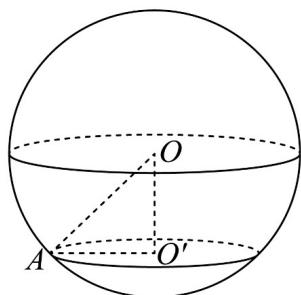
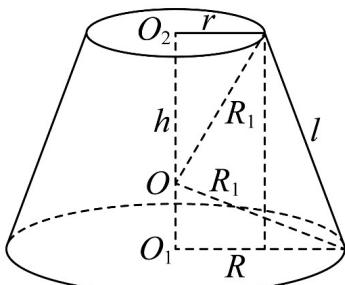

> [!faq]- 《专题03 圆柱、圆锥、圆台及球表面积与体积的五大常考题型（高效培优专项训练）》官方解析
>
> > [!success]- **【答案】** C
>
> > [!note]- **【分析】**
> > 根据球截面的性质，结合球的表面积公式进行求解即可.
>
> > [!note]- **【解析】**
> > 如图所示，由题可得截面圆的半径为 $O'A=1$ ，
> >
> > 因为球心 O 到 $\alpha$ 的距离为 1，所以 $O'O=1$ ，
> >
> > 球 O 的半径 $r = \sqrt{O'O^{2} + O'A^{2}} = \sqrt{1^{2} + 1^{2}} = \sqrt{2}$
> >
> > 所以球 O 的表面积为 $4\pi r^{2} = 8\pi$ .
> >
> > 故选：C
> >
> > 
> >
> > 49．圆台的上、下底面半径分别为 r 、 R ，且 R = 3r ，母线 l = 4r ，圆台的表面积为 $78\pi$ ，若球 O 为圆台的外接球，且球心在圆台内部，则该球的表面积为（）
> >
> > 【答案】
> >
> > A. $110\pi$ B. $111\pi$ C. $112\pi$ D. $113\pi$
> >
> > 【答案】C
> >
> > 【分析】如图，根据圆台的表面积公式和勾股定理求出球的半径，结合球的表面积公式计算即可求解.
> > 【详解】如图，设圆台的高为 h，上、下底面圆的圆心分别为 $O_{2}, O_{1}$ ，圆台外接球的半径为 $R_{1}$ ，
> >
> > 
> >
> > 圆台的表面积为 $S = \pi r^2 +\pi R^2 +\pi rl + \pi Rl = 26\pi r^2 = 78\pi$
> >
> > 解得 $r = \sqrt{3}$ ， $R = 3\sqrt{3}$ ，则 $h = \sqrt{l^2 - (R - r)^2} = 2\sqrt{3} r = 6$
> >
> > 由图可知 $R_{1}^{2} = r^{2} + O_{2}O^{2}, R_{1}^{2} = R^{2} + (h - O_{2}O)^{2}$
> >
> > 有 $r^2 + O_2O^2 = R^2 + (h - O_2O)^2$ ，即 $3 + O_2O^2 = 27 + (6 - O_2O)^2$
> >
> > 解得 $O_{2}O = 5$ ，则 $R_1^2 = r^2 + O_2O^2 = 28$
> >
> > 所以外接球的表面积为 $4\pi R_{1}^{2} = 112\pi$ .
> >
> > 故选 **C**
