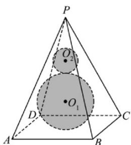
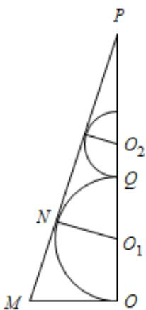
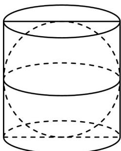

> [!faq]- 《专题03 圆柱、圆锥、圆台及球表面积与体积的五大常考题型（高效培优专项训练）》官方解析
>
> > [!success]- **【答案】** 
>
> > [!note]- **【分析】**
> > 先求出正四棱锥的高，利用相切可求球的半径，结合体积公式可得答案.
>
> > [!note]- **【解析】**
> > 正四棱锥的底面边长为 $^{4}$ ，侧棱长为 $2\sqrt{10}$ ，所以斜高为 $\sqrt{\left(2\sqrt{10}\right)^{2}-2^{2}}=6$ ，高为 $\sqrt{6^{2}-2^{2}}=4\sqrt{2}$ ，设底面中心为 $O$ ， $AD$ 的中点为 $M$ ，如图，截面 $POM$ 中，设 $N$ 为球 $O_{1}$ 与平面 $PAD$ 的切点，则 $N$ 在 $PM$ 上，且 $O_{1}N\perp PM$ 。设球 $O_{1}$ 的半径为 $R$ ，则 $O_{1}N=O_{1}O=R$ ，因为 $\sin\angle MPO=\frac{OM}{PM}=\frac{2}{6}=\frac{1}{3}$ ，所以 $\frac{NO_{1}}{PO_{1}}=\frac{1}{3}$ ，所以 $PO_{1}=3R$ ，所以 $PO=PO_{1}+OO_{1}=4R=4\sqrt{2}$ ，即 $R=\sqrt{2}$ 。设球 $O_{1}$ 与球 $O_{2}$ 相切于点 $Q$ ，则 $PQ=PO-2R=2R$ ，设球 $O_{2}$ 的半径为 $r$ ，同理可得 $PQ=4r$ ，所以 $r=\frac{R}{2}=\frac{\sqrt{2}}{2}$ ，故小球 $O_{2}$ 的体积为 $\frac{4}{3}\pi\left(\frac{\sqrt{2}}{2}\right)^{3}=\frac{\sqrt{2}}{3}\pi$ 。
> >
> > 故选：A
> >
> > 
> >
> > 33．古希腊数学家阿基米德的一个重要数学发现是“圆柱容球”，即当球的直径与圆柱底面的直径和圆柱的高均相等时，球的体积是圆柱体积的 $\frac{2}{3}$ ，且球的表面积也是圆柱表面积的 $\frac{2}{3}$ ．如图所示，在一个“圆柱容球”的模型中，若球的体积为 $8\sqrt{6}\pi$ ，则该模型中圆柱的表面积为（）
> >
> > 【答案】
> >
> > 
> >
> > A. $18\pi$ B. $24\pi$ C. $30\pi$ D. $36\pi$
> >
> > 【答案】D
> >
> > 【分析】利用球的体积公式和圆柱的表面积公式求解.
> >
> > 【详解】解：可设球的半径为 r，则根据题意可知圆柱的底面半径也为 r，
> >
> > ∵ 圆柱的高等于直径，∴圆柱的高等于2r
> >
> > $\therefore$ 球的体积为 $8\sqrt{6}\pi$ ， $\therefore \frac{4}{3}\pi r^3 = 8\sqrt{6}\pi$
> >
> > $$
> > \therefore r = \sqrt {6}
> > $$
> >
> > ∴圆柱的表面积公式为 $S = \pi r^{2} \times 2 + 2\pi r \cdot 2r = 6\pi r^{2} = 6\pi \times \left(\sqrt{6}\right)^{2} = 36\pi$ .
> >
> > 故选 **D**.
