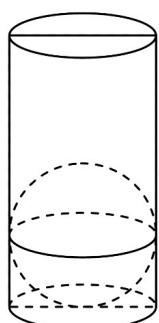

> [!faq]- 《专题03 圆柱、圆锥、圆台及球表面积与体积的五大常考题型（高效培优专项训练）》官方解析
>
> > [!success]- **【答案】** 2
>
> > [!note]- **【分析】**
> > 要使小球沉入容器底部，且水没有溢出容器，只需小球的体积不大于容器剩余的容积，利用圆柱和球的体积公式求解即可.
>
> > [!note]- **【解析】**
> > 要使小球沉入容器底部，且水没有溢出容器，
> >
> > 只需小球的体积不大于容器剩余的容积，
> >
> > 由题意知小球体积为 $V=\frac{4}{3}\pi \times r^{3}$
> >
> > 容器剩余的容积为 $V_{1}=\pi\times2^{2}\times9=36\pi$
> >
> > 由 $V=\frac{4}{3}\pi\times r^{3}\leq36\pi$ ，解得 $r\leq3$ ，又圆柱底面半径为 2 ，
> >
> > 所以该小球的半径的最大值是 2.
> >
> > 故答案为：2.
> >
> > 
