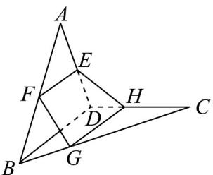

<!-- question-source:start -->
1．如图，空间四边形ABCD中，E,F分别是AD,AB的中点，G,H分别在BC,CD上，且BG:GC=DH:HC=1:2.

(1)求证： $E,F,G,H$ 四点共面；

(2)设 $FG$ 与 $HE$ 交于点 $P$ ，求证： $P,A,C$ 三点共线.
<!-- question-source:end -->

![[高中/课堂同步/题库/人教A版高中数学同步讲义(2026)/02_必修第二册/第八章 立体几何初步/专题04 空间中点线面关系的五大常考题型（高效培优专项训练）/题型一_空间中点线共面问题/questions/answers/Q00069638A1.md]]
