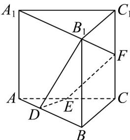

<!-- question-source:start -->
3．如图，在正三棱柱 $ABC-A_{1}B_{1}C_{1}$ 中，侧棱与底面边长均为 2，点 E, F 分别为 $AC, CC_{1}$ 的中点，点 D 满足 $AD = \frac{1}{3} AB$ ．求证： $B_{1}, D, E, F$ 四点共面．

<!-- question-source:end -->

![[高中/课堂同步/题库/人教A版高中数学同步讲义(2026)/02_必修第二册/第八章 立体几何初步/专题04 空间中点线面关系的五大常考题型（高效培优专项训练）/题型一_空间中点线共面问题/questions/answers/Q00069640A1.md]]
