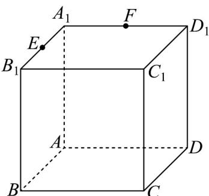

<!-- question-source:start -->
4．在正方体 $ABCD-A_{1}B_{1}C_{1}D_{1}$ 中，E、F 分别为 $A_{1}B_{1}$ 与 $A_{1}D_{1}$ 的中点，求证：E、F、B、D 四点共面

<!-- question-source:end -->

![[高中/课堂同步/题库/人教A版高中数学同步讲义(2026)/02_必修第二册/第八章 立体几何初步/专题04 空间中点线面关系的五大常考题型（高效培优专项训练）/题型一_空间中点线共面问题/questions/answers/Q00069641A1.md]]
