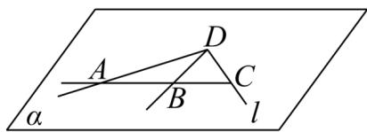

<!-- question-source:start -->
7．已知： $l \subset \alpha, D \in \alpha, A \in l, B \in l, C \in l, D \notin l$ ，求证：直线 AD, BD, CD 共面于 $\alpha$ .

<!-- question-source:end -->

![[高中/课堂同步/题库/人教A版高中数学同步讲义(2026)/02_必修第二册/第八章 立体几何初步/专题04 空间中点线面关系的五大常考题型（高效培优专项训练）/题型一_空间中点线共面问题/questions/answers/Q00069644A1.md]]
