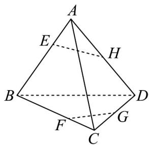

<!-- question-source:start -->
8．在空间四边形ABCD中，H，G分别是AD，CD的中点，E，F分别边AB，BC上的点，且 $\frac{CF}{FB} = \frac{AE}{EB} = \frac{1}{3}$ ．求证：

(1)四边形 EFGH 为梯形；

(2)直线 EH, BD, FG 相交于一点.
<!-- question-source:end -->

![[高中/课堂同步/题库/人教A版高中数学同步讲义(2026)/02_必修第二册/第八章 立体几何初步/专题04 空间中点线面关系的五大常考题型（高效培优专项训练）/题型一_空间中点线共面问题/questions/answers/Q00069645A1.md]]
