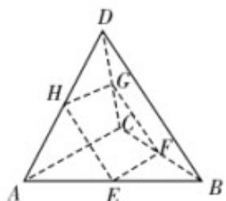

> [!faq]- 《专题04 空间中点线面关系的五大常考题型（高效培优专项训练）》官方解析
>
> > [!success]- **【答案】** B
>
> > [!note]- **【分析】**
> > 根据空间中点和线的位置关系，即可求解 A，B，C，根据线线平行及垂直判定四边形形状判断 D
>
> > [!note]- **【解析】**
> > 对 A，四点共面不一定得到三点共线，比如平面四边形，故 A 错误，
> >
> > 对于 B，若空间四点中有三点共线，则此四点必共面；B 正确，
> >
> > 对于 C，若空间四点中任何三点不共线，则此四点可能共面；比如平面四边形，C 错误，
> >
> > 对于 D，空间四边形 ABCD 中， $AC \perp BD$ ，E，F，分别为 AB，BC 的中点，G，H 分别为 CD，DA 的中点，所以 $EF \parallel AC, HG \parallel AC$ ，所以 $EF \parallel HG$ ，
> >
> > 同理 $HE \parallel BD, GF \parallel BD$ ，所以 $HE \parallel GF$ ，则四边形 EFGH 为长方形，不能得出正方形，D 选项错误；
> >
> > 故选：B
> >
> > 
