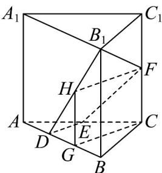

> [!faq]- 《专题04 空间中点线面关系的五大常考题型（高效培优专项训练）》官方解析
>
> > [!success]- **【答案】** 证明见解析
>
> > [!note]- **【分析】**
> > 取 $B_{1}D$ 中点 $H$ ，过 $H$ 作 $HG \perp AB$ 于 $G$ ，连接 $HF$ ， $GC$ ，依次证明 $GC // HF$ ， $DE // HF$ ，即可证明 $H$ ， $D$ ， $E$ ， $F$ 四点共面，最后由 $B_{1} \in DH$ 即可得证；
>
> > [!note]- **【解析】**
> > 取 $B_{1}D$ 中点H，过H作 $HG\perp AB$ 于G，连接HF，GC，
> >
> > 则 $DG = GB$ ， $HG / / BB_{1} / / CF$ ， $HG = \frac{1}{2} BB_{1} = CF$
> >
> > 所以四边形 HGCF 是平行四边形，∴ GC // HF ，
> >
> > 由 $AD=\frac{1}{3}AB$ 得 $AD=\frac{1}{3}AB$ ，∴ $DG=\frac{1}{2}DB=\frac{1}{3}AB=AD$ ，
> >
> > 又 $AE = EC$ ， $\therefore DE // GC$ ， $\therefore DE // HF$ ，所以 $H$ ， $D$ ， $E$ ， $F$ 四点共面，
> >
> > 又 $B_{1} \in DH$ ，所以 $B_{1}$ ， $D$ ， $E$ ， $F$ 四点共面.
> >
> > 
