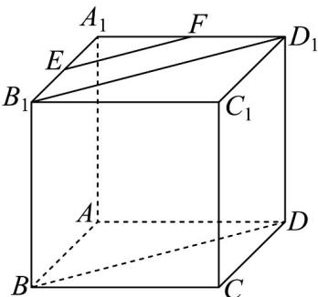

> [!faq]- 《专题04 空间中点线面关系的五大常考题型（高效培优专项训练）》官方解析
>
> > [!success]- **【答案】** 证明见解析
>
> > [!note]- **【分析】**
> > 可得 $BD \parallel B_{1}D_{1}$ ， $EF \parallel B_{1}D_{1}$ ，所以可得 $EF \parallel BD$ ，即可求证.
>
> > [!note]- **【解析】**
> > 
> >
> > 连接 $EF, BD, B_{1}D_{1}$
> >
> > 因为 $BB_{1} //DD_{1}, BB_{1} = DD_{1}$ ，可知 $BB_{1}D_{1}D$ 为平行四边形，
> >
> > 则 $BD\parallel B_1D_1$
> >
> > 因为 E、F 分别为 $A_{1}B_{1}$ 与 $A_{1}D_{1}$ 的中点，由中位线可知 $EF \parallel B_{1}D_{1}$
> >
> > 所以 $EF \parallel BD$
> >
> > 所以 E、F、B、D 四点共面.
