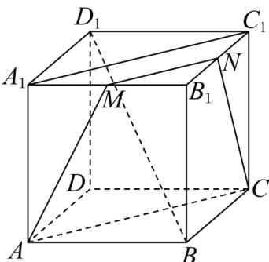

> [!faq]- 《专题04 空间中点线面关系的五大常考题型（高效培优专项训练）》官方解析
>
> > [!success]- **【答案】** (1)证明见详解； (2)证明见详解.
>
> > [!note]- **【分析】**
> > （1）连结 $MN, A_{1}C_{1}, AC$ ，根据点 $M, N$ 分别是 $A_{1}B_{1}, B_{1}C_{1}$ 的中点，利用平行关系的传递性得到 $MN \parallel AC$ 即可；
> >
> > （2）易得 AM 与 CN 相交，设交点为 P，则能得到 $P \in$ 平面 $ABB_{1}A_{1}$ ， $P \in$ 平面 $BCC_{1}B_{1}$ ，结合平面 $ABB_{1}A_{1} \cap$ 平面 $BCC_{1}B_{1}=BB_{1}$ ，即可得证；
>
> > [!note]- **【解析】**
> > （1）如图，连结 $MN, A_{1}C_{1}, AC$
> >
> > 
> >
> > ∵点M,N分别是 $A_{1}B_{1},B_{1}C_{1}$ 的中点，∴ $MN//A_{1}C_{1}$
> >
> > ∵四边形 $A_{1}ACC_{1}$ 为平行四边形，∴ $A_{1}C_{1} // AC$
> >
> > ∴MN//AC
> >
> > $\therefore A, M, N, C$ 四点共面，即 $AM$ 和 $CN$ 共面。
> >
> > (2) 证明：正方体 $ABCD - A_{1}B_{1}C_{1}D_{1}$ 中，
> >
> > ∵点 M, N 分别是 $A_{1}B_{1}, B_{1}C_{1}$ 的中点，∴ $MN//A_{1}C_{1}$ 且 $MN \neq A_{1}C_{1}$
> >
> > ∵四边形 $A_{1}ACC_{1}$ 为平行四边形，∴ $A_{1}C_{1} // AC$ ，且 $A_{1}C_{1} = AC$
> >
> > ∴MN∥AC且MN≠AC
> >
> > ∴ AM 与 CN 相交，设交点为 P，
> >
> > $\because P \in AM, AM \subset \text{平面} ABB_{1}A_{1}, \therefore P \in \text{平面} ABB_{1}A_{1}$ ;
> >
> > 又∵ $P\in CN$ ， $CN\subset$ 平面 $BCC_{1}B_{1}$ ，∴ $P\in$ 平面 $BCC_{1}B_{1}$
> >
> > ∵平面 $ABB_{1}A_{1} \cap$ 平面 $BCC_{1}B_{1} = BB_{1}$ ，∴ $P \in BB_{1}$
> >
> > $\therefore AM、BB_{1}、CN$ 三线交于点 P.
