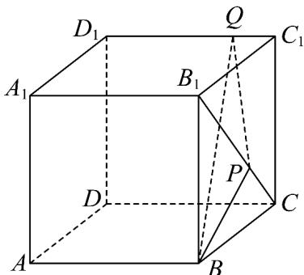

<!-- question-source:start -->
22．如图，正方体 $ABCD - A_{1}B_{1}C_{1}D_{1}$ 的棱长为 4， $B_{1}P = 2PC$ ， $D_{1}Q = 3QC_{1}$ ，设过 B, P, Q 三点的平面为 $\beta$ ，
平面 $\beta\cap$ 平面 $A_{1}B_{1}C_{1}D_{1}=l$

(1)求三棱锥 $B_{1} - BPQ$ 的体积；

(2)求证：直线 $l, BP, B_{1}C_{1}$ 交于一点.
<!-- question-source:end -->

![[高中/课堂同步/题库/人教A版高中数学同步讲义(2026)/02_必修第二册/第八章 立体几何初步/专题04 空间中点线面关系的五大常考题型（高效培优专项训练）/题型三_空间中线共点问题/questions/answers/Q00069657A1.md]]
