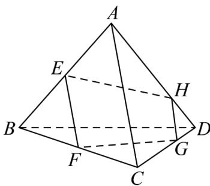

<!-- question-source:start -->
24．如图，已知空间四边形ABCD，E，F分别是AB，BC的中点，G，H分别在CD和AD上，且满足 $\frac{CG}{GD} = \frac{AH}{HD} = 2$ ．求证：

(1) $E, F, G, H$ 四点共面；

(2) $EH$ ，FG，BD三线共点.
<!-- question-source:end -->

![[高中/课堂同步/题库/人教A版高中数学同步讲义(2026)/02_必修第二册/第八章 立体几何初步/专题04 空间中点线面关系的五大常考题型（高效培优专项训练）/题型三_空间中线共点问题/questions/answers/Q00069659A1.md]]
