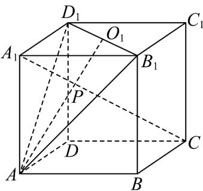

<!-- question-source:start -->
25．如图，点 $O_{1}$ 是正方体 $ABCD - A_{1}B_{1}C_{1}D_{1}$ 的上底面的中心，过 $D_{1}$ ， $B_{1}$ ， $A$ 三点作一个截面．求证：此截

面与对角线 $A_{1}C$ 的交点 P 一定在 $AO_{1}$ 上.

<!-- question-source:end -->

![[高中/课堂同步/题库/人教A版高中数学同步讲义(2026)/02_必修第二册/第八章 立体几何初步/专题04 空间中点线面关系的五大常考题型（高效培优专项训练）/题型三_空间中线共点问题/questions/answers/Q00069660A1.md]]
