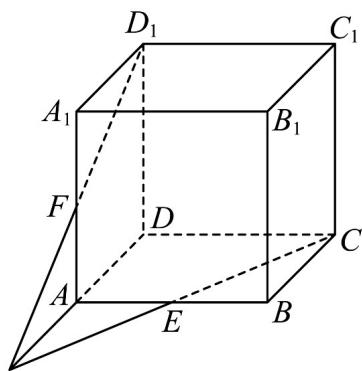

<!-- question-source:start -->
26．如图所示，已知棱长为1正方体 $ABCD - A_{1}B_{1}C_{1}D_{1}$ 中，点 $E,F$ 分别是棱 $AB,AA_{1}$ 的中点.

求证：三条直线 $DA, CE, D_1F$ 交于一点；
<!-- question-source:end -->

![[高中/课堂同步/题库/人教A版高中数学同步讲义(2026)/02_必修第二册/第八章 立体几何初步/专题04 空间中点线面关系的五大常考题型（高效培优专项训练）/题型三_空间中线共点问题/questions/answers/Q00069661A1.md]]
