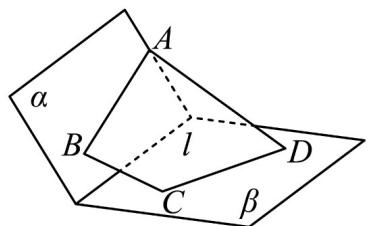

<!-- question-source:start -->
27．如图，已知平面 $\alpha,\beta$ ，且 $\alpha\cap\beta=l$ ，设在梯形 ABCD 中，AD//BC，且 $AB\subset\alpha,CD\subset\beta$ 。求证：AB,CD,l 共点。

<!-- question-source:end -->

![[高中/课堂同步/题库/人教A版高中数学同步讲义(2026)/02_必修第二册/第八章 立体几何初步/专题04 空间中点线面关系的五大常考题型（高效培优专项训练）/题型三_空间中线共点问题/questions/answers/Q00069662A1.md]]
