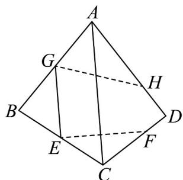

<!-- question-source:start -->
30．如图，在三棱锥 A-BCD 中，E，G 分别是 EC，AB 的中点，点 F 在 CD 上，点 H 在 AD 上，且有
DF:FC=DH:HA=2:3.试判定直线 EF, GH, BD 的位置关系.

<!-- question-source:end -->

![[高中/课堂同步/题库/人教A版高中数学同步讲义(2026)/02_必修第二册/第八章 立体几何初步/专题04 空间中点线面关系的五大常考题型（高效培优专项训练）/题型三_空间中线共点问题/questions/answers/Q00069665A1.md]]
