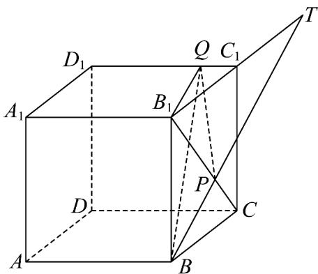

> [!faq]- 《专题04 空间中点线面关系的五大常考题型（高效培优专项训练）》官方解析
>
> > [!success]- **【答案】** (1) $V_{B_{1}-QPB}=\frac{16}{9}$ (2)证明见解析
>
> > [!note]- **【分析】**
> > （1）求出 $V_{Q-B_{1}PB}$ 可得 $V_{B_{1}-QPB}$ ；
> >
> > (2) 利用基本事实 3 可证三线共点.
>
> > [!note]- **【解析】**
> > （1）连接 $B_{1}Q$ ， $Q$ 到平面 $B_{1}PB$ 的距离为 $QC_{1} = \frac{1}{4} D_{1}C_{1} = 1$
> >
> > 因为 $B_{1}P = 2PC$ ，故 $S_{\triangle B_1BP} = \frac{2}{3} S_{\triangle B_1BC} = \frac{2}{3}\times \frac{1}{2}\times 4\times 4 = \frac{16}{3}$
> >
> > 故 $V_{Q - B_1PB} = \frac{1}{3}\times QC_1\times S_{\triangle B_1BP} = \frac{16}{9}$ ，故 $V_{B_1 - QPB} = \frac{16}{9}$
> >
> > (2) 在平面 $BCC_{1}B_{1}$ 中， $BP, B_{1}C_{1}$ 不平行，设 $BP \cap B_{1}C_{1} = T$
> >
> > 
> >
> > 则 $T \in BP$ 且 $T \in B_{1}C_{1}$ ，故 $T \in$ 平面 $A_{1}B_{1}C_{1}D_{1}$ 且 $T \in$ 平面 $BPQ$
> >
> > 故 $T \in$ 平面 $BPQ\mathrm{I}$ 平面 $A_{1}B_{1}C_{1}D_{1} = l$
> >
> > 所以 $BP, B_{1}C_{1}, l$ 三线共点.
