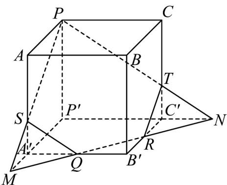
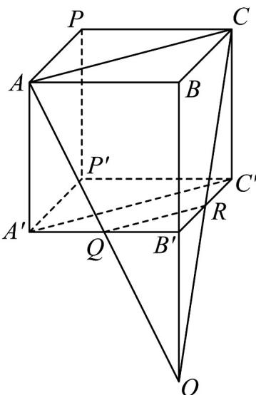

> [!faq]- 《专题04 空间中点线面关系的五大常考题型（高效培优专项训练）》官方解析
>
> > [!success]- **【答案】** (1)图象见解析； (2)证明见解析.
>
> > [!note]- **【分析】**
> > （1）根据给定条件，利用平面的基本性质作图.
> >
> > (2) 证明四边形 $AQRC$ 为梯形，设 $AQ \cap CR = O$ ，再证明 $O \in BB'$ ，即可得到 $AQ, CR, BB'$ 三线共点。
>
> > [!note]- **【解析】**
> > （1）作直线QR分别交 $P'A',P'C'$ 的延长线于M,N，连接MP交 $AA'$ 于S，
> >
> > 连接 $PN$ 交 $CC'$ 于点 $T$ ，连接 $SQ,TR$ ，则五边形 $PSQRT$ 即为所求，如图：
> >
> > 
> >
> > （2）如图，连接 $QR$ ， $AC$ ， $A^{\prime}C^{\prime}$ ，四边形 $ACC^{\prime}A^{\prime}$ 是正四棱柱 $ABCP - A^{\prime}B^{\prime}C^{\prime}P^{\prime}$ 的对角面，则 $AC = A^{\prime}C^{\prime}$ ， $AC // A^{\prime}C^{\prime}$
> >
> > 
> >
> > 由 $Q$ 、 $R$ 分别为 $A'B'$ 、 $B'C'$ 中点，得 $QR // A'C', A'C' = 2QR$ ，则 $QR // AC$ ，且 $AC = 2QR$
> >
> > 即四边形 $AQRC$ 为梯形，令 $AQ \cap CR = O$ ，则 $O \in AQ$ ，而 $AQ \subset$ 平面 $A'AB$ ，
> >
> > 则 $O \in$ 平面 $A'AB$ ，同理 $O \in$ 平面 $C'CB$ ，又平面 $A'AB \cap$ 平面 $C'CB = BB'$ ，因此 $O \in BB'$
> >
> > 所以 AQ, CR, BB' 三线共点.
