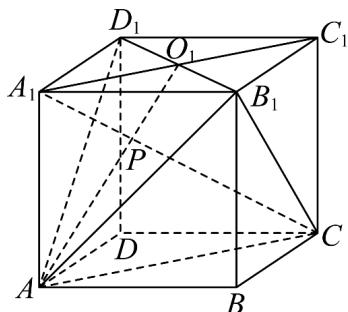

> [!faq]- 《专题04 空间中点线面关系的五大常考题型（高效培优专项训练）》官方解析
>
> > [!success]- **【答案】** 证明见解析
>
> > [!note]- **【分析】**
> > 由已知条件利用基本事实三得到平面 $AB_{1}D_{1} \cap$ 平面 $ACC_{1}A_{1} = AO_{1}$ ，且 $P \in$ 平面 $ACC_{1}A_{1}$ ， $P \in$ 平面 $AB_{1}D_{1}$ ，由此利用基本事实三，即可证得对角线 $A_{1}C$ 与平面 $AB_{1}D_{1}$ 的交点 $P$ 一定在 $AO_{1}$ 上.
>
> > [!note]- **【解析】**
> > 证明：如图所示，连接 $A_{1}C_{1}, AC$
> >
> > 因为 $O_{1}$ 是正方体 $ABCD - A_{1}B_{1}C_{1}D_{1}$ 的上底面的中心，
> >
> > 所以 $O_{1} \in A_{1}C_{1}$ ，且 $O_{1} \in B_{1}D_{1}$
> >
> > 因为 $A_{1}C_{1}\subset$ 平面 $ACC_{1}A_{1}$ ， $B_{1}D_{1}\subset$ 平面 $AB_{1}D_{1}$
> >
> > 所以 $O_{1} \in$ 平面 $ACC_{1}A_{1}$ ， $O_{1} \in$ 平面 $AB_{1}D_{1}$
> >
> > 又因为 $A \in$ 平面 $ACC_{1}A_{1}$ ， $A \in$ 平面 $AB_{1}D_{1}$
> >
> > 所以平面 $AB_{1}D_{1}\cap$ 平面 $ACC_{1}A_{1} = AO_{1}$
> >
> > 因为对角线 $A_{1}C \cap$ 平面 $AB_{1}D_{1} = P$ ，所以 $P \in$ 平面 $ACC_{1}A_{1}$ ， $P \in$ 平面 $AB_{1}D_{1}$
> >
> > 所以由基本事实三可得，对角线 $A_{1}C$ 与平面 $AB_{1}D_{1}$ 的交点 P 一定在 $AO_{1}$ 上.
> >
> > 
