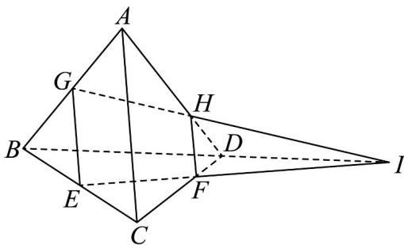

> [!faq]- 《专题04 空间中点线面关系的五大常考题型（高效培优专项训练）》官方解析
>
> > [!success]- **【答案】** 直线 EF, GH, BD 三线共点
>
> > [!note]- **【分析】**
> > 可先利用平行证明共面，再利用公理 3 可证明三线共点
>
> > [!note]- **【解析】**
> > 如图，连接 GE, HF，因为 E, G 分别是 BC, AB 的中点，所以 GE 为 VABC 的中位线，
> >
> > 所以 $GE \parallel AC$ 且 $GE = \frac{1}{2} AC$ ，又 $DF:FC = DH:HA = 2:3$
> >
> > 所以 $HF \parallel AC$ ，且 $HF = \frac{2}{5} AC$ 。
> >
> > 由公理 4， $GE \parallel HF$ ，且 $GE \neq HF$ ，
> >
> > 所以 $GH$ ，EF共面且不平行，因此延长GH，EF交于I.
> >
> > 则 $I \in GH$ 且 $I \in EF$
> >
> > 又因为面 $ABD \cap$ 面 CBD = BD , 所以由公理 3 $I \in BD$
> >
> > 故 $EF$ ，GH，BD三线共点
> >
> > 
