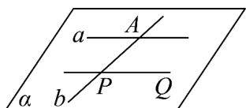

<!-- question-source:start -->
11. 如图，已知： $a \subset \alpha$ ， $b \subset \alpha$ ， $a \cap b = A$ ， $P \in b$ ， $PQ // a$ ，求证： $PQ \subset \alpha$

<!-- question-source:end -->

![[高中/课堂同步/题库/人教A版高中数学同步讲义(2026)/02_必修第二册/第八章 立体几何初步/专题04 空间中点线面关系的五大常考题型（高效培优专项训练）/题型二_空间中点共线问题/questions/answers/Q00069648A1.md]]
