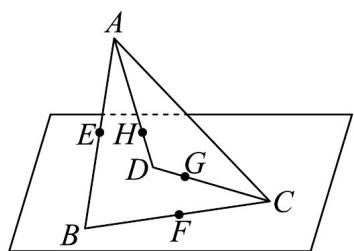

<!-- question-source:start -->
13．如图，ABCD为空间四边形，点E、F分别是AB、BC的中点，点G、H分别在CD、AD上，且 $DH=\frac{1}{3}AD$ ， $DG=\frac{1}{3}CD$ ．求证：

(1) $E$ 、 $F$ 、 $G$ 、 $H$ 四点共面；

(2) $EH$ 、 $FG$ 必相交且交点在直线 $BD$ 上.
<!-- question-source:end -->

![[高中/课堂同步/题库/人教A版高中数学同步讲义(2026)/02_必修第二册/第八章 立体几何初步/专题04 空间中点线面关系的五大常考题型（高效培优专项训练）/题型二_空间中点共线问题/questions/answers/Q00069650A1.md]]
