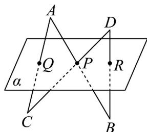

<!-- question-source:start -->
16．如图所示， $AB \cap \alpha = P$ ， $CD \cap \alpha = P$ ，A，D与B，C分别在平面 $\alpha$ 的两侧， $AC \cap \alpha = Q$ ， $BD \cap \alpha = R$ ．求证：P，Q，R三点共线.

<!-- question-source:end -->

![[高中/课堂同步/题库/人教A版高中数学同步讲义(2026)/02_必修第二册/第八章 立体几何初步/专题04 空间中点线面关系的五大常考题型（高效培优专项训练）/题型二_空间中点共线问题/questions/answers/Q00069653A1.md]]
