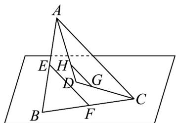
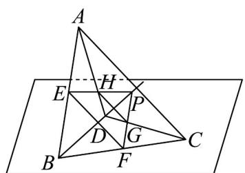

> [!faq]- 《专题04 空间中点线面关系的五大常考题型（高效培优专项训练）》官方解析
>
> > [!success]- **【答案】** (1)证明见解析 (2)证明见解析
>
> > [!note]- **【分析】**
> > （1）根据中位线及等比分点可得平行，进而可证四点共面；
> >
> > (2) 结合面面位置关系可得证.
>
> > [!note]- **【解析】**
> > （1）
> >
> > 
> >
> > 连接 AC、EF，HG，
> >
> > 由 $E$ ， $F$ 分别为 $AB$ ， $BC$ 中点，则 $EF \parallel AC$
> >
> > 又 $DH = \frac{1}{3} AD$ ， $DG = \frac{1}{3} CD$ ，则 $HG // AC$ ，
> >
> > $$
> > \therefore E F \mathbin {/ /} H G
> > $$
> >
> > ∴ E 、 F 、 G 、 H 四点共面.
> >
> > (2)
> >
> > 
> >
> > 由 $DH = \frac{1}{3} AD$ ， $DG = \frac{1}{3} CD$
> >
> > 易知 $HG = \frac{1}{3} AC$ ，
> >
> > 又 E，F 分别为 AB，BC 中点，即 $EF = \frac{1}{2} AC$ ，
> > ∴ $HG \neq EF$
> >
> > 结合（1）的结论可知，四边形 EFGH 是梯形，因此直线 EH、FG 不平行，
> > 设它们交点为 P， $P \in$ 平面 ABD，同理 $P \in$ 平面 BCD，
> > 又平面 $ABD \cap$ 平面 BCD = BD，因此 $P \in BD$ ，
> > 即 EH、FG 必相交且交点在直线 BD 上．
