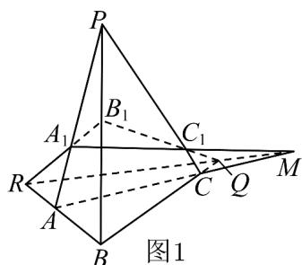
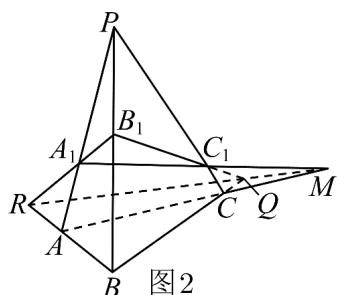

> [!faq]- 《专题04 空间中点线面关系的五大常考题型（高效培优专项训练）》官方解析
>
> > [!success]- **【答案】** 证明见解析
>
> > [!note]- **【分析】**
> > 推导出 P 、 Q 、 R 是平面 $\alpha$ 与平面 ACBD 的公共点，由此能证明 P ， Q ， R 三点共线．
>
> > [!note]- **【解析】**
> > 证明：∵ $AB \cap \alpha = P$ ， $CD \cap \alpha = P$ ，A，D 与 B，C 分别在平面 $\alpha$ 的两侧，
> >
> > $\therefore AB \cap CD = P$ ， $\therefore A$ 、 $C$ 、 $B$ 、 $D$ 构成一个平面，
> >
> > $\because AC\cap \alpha = Q$ $BD\cap \alpha = R$ $AB\cap \alpha = P$ $CD\cap \alpha = P$
> >
> > ∴ P 、 Q 、 R 是平面 $\alpha$ 与平面 ACBD 的公共点，
> >
> > ∴ P 、 Q 、 R 都在平面 $\alpha$ 与平面 ACBD 的交线上，
> >
> > $\therefore P, Q, R$ 三点共线.
> >
> > 17. 平面中有VABC和 $^{\triangle}A_{1}B_{1}C_{1}, AA_{1}, BB_{1}$ 和 $CC_{1}$ 三直线交于一点，若对应边所在的直线都相交，证明三个交点P,Q,R共线.
> >
> > 【答案】证明见解析
> >
> > 【分析】根据题意，分VABC和 $\triangle A_{1}B_{1}C_{1}$ 不在同一平面内与在一个平面内讨论，结合三棱锥的结构特征，即可证明.
> >
> > 【详解】证明：如图1，先考虑VABC和 $\triangle A_{1}B_{1}C_{1}$ 不在同一平面内，则由条件知，
> >
> > 它们可构成一个三棱锥 $P - ABC$ ，而 $\triangle A_{1}B_{1}C_{1}$ 是它的一个截面，
> >
> > 且VABC和 $\triangle A_{1}B_{1}C_{1}$ 的对应边所在的直线都相交.
> >
> > 
> >
> > 设 $AC$ 与 $A_{1}C_{1}$ 交于点 $M$ ，则 $M\in$ 平面 $ABC,M\in$ 平面 $A_{1}B_{1}C_{1}$
> >
> > ∴点 M 必落在平面 ABC 与平面 $A_{1}B_{1}C_{1}$ 的交线上，
> >
> > 同理，AB 与 $A_{1}B_{1}$ 的交点，BC 与 $B_{1}C_{1}$ 的交点都落在平面 ABC 与平面 $A_{1}B_{1}C_{1}$ 的交线上，
> >
> > ∴三对应边的交点共线．只要选取适当的投影方向，
> >
> > 便得到一个如图 2 所示的图形（投影图），从而原问题获证。
> >
> > 
