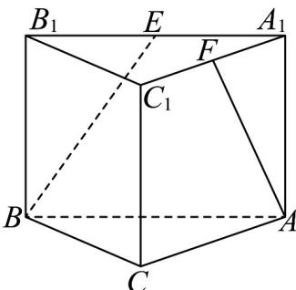

<!-- question-source:start -->
38．如图，在直三棱柱 $ABC-A_{1}B_{1}C_{1}$ 中， $\angle BCA=90^{\circ}$ ，E,F 分别是 $A_{1}B_{1}$ ， $A_{1}C_{1}$ 的中点．若 $BC=CA=CC_{1}$ ，则异面直线 BE 与 AF 所成角的余弦值为 \_\_\_\_．

<!-- question-source:end -->

![[高中/课堂同步/题库/人教A版高中数学同步讲义(2026)/02_必修第二册/第八章 立体几何初步/专题04 空间中点线面关系的五大常考题型（高效培优专项训练）/题型四_异面直线考点/questions/answers/Q00069673A1.md]]
