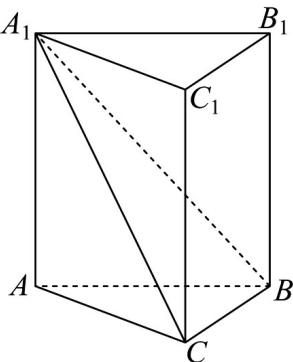

> [!faq]- 《专题04 空间中点线面关系的五大常考题型（高效培优专项训练）》官方解析
>
> > [!success]- **【答案】**  A. 直线 $AB$ 与直线 $B_{1}C_{1}$ 所成角为 $\frac{\pi}{3}$ B. 三棱锥 $A - A_{1}BC$ 的体积为 $12\sqrt{3}$ C. 点 $C_{1}$ 到平面 $A_{1}BC$ 的距离为 $\sqrt{13}$ D. 四棱锥 $A_{1} - B_{1}BCC_{1}$ 的外接球的表面积为 $64\pi$
>
> > [!note]- **【分析】**
> > 根据定义，异面直线 AB 与直线 $B_{1}C_{1}$ 所成角，即为 $\angle ABC$ 或其补角，即可判断 A；应用等体积法求体积判断 B；首先求出 $A_{1}$ 到平面 $A_{1}BC$ 的距离，再结合对称性判断 C；由四棱锥 $A_{1}-B_{1}BCC_{1}$ 的外接球，即为该三棱柱的外接球，进而求半径，即可得表面积判断 D.
>
> > [!note]- **【解析】**
> > A：由题设 $B_{1}C_{1}//BC$ ，则直线AB与直线 $B_{1}C_{1}$ 所成角，即为 $\angle ABC$ 或其补角，
> >
> > 又VABC为等边三角形，故 $\angle ABC = \frac{\pi}{3}$ ，对；
> >
> > B：由 $V_{A - A_1BC} = V_{A_1 - ABC} = \frac{1}{3}\times 4\times \frac{1}{2}\times 6^2\times \sin 60^\circ = 12\sqrt{3}$ ，对；
> >
> > C：由 $A_{1}B = A_{1}C = 2\sqrt{13}$ ， $BC = 6$ ，则 $\triangle A_{1}BC$ 中 $BC$ 上的高为 $\sqrt{43}$ 所以 $S_{\triangle A_{1}BC} = \frac{1}{2} \times 6 \times \sqrt{43} = 3\sqrt{43}$ ，若 A 到平面 $A_{1}BC$ 的距离为 d，则 $\frac{1}{3}d \times 3\sqrt{43} = 12\sqrt{3}$ ，
> > 所以 $d=\frac{12\sqrt{3}}{\sqrt{43}}$ ，根据对称性易知点 $C_{1}$ 到平面 $A_{1}BC$ 的距离为 $\frac{12\sqrt{3}}{\sqrt{43}}$ ，错；
> > D：由题设，易知四棱锥 $A_{1}-B_{1}BCC_{1}$ 的外接球，即为该三棱柱的外接球，
> > 而 VABC 的外接圆半径 $r=\frac{2}{3}\times\frac{\sqrt{3}}{2}\times6=2\sqrt{3}$ ，且 $AA_{1}=4$ ，
> > 所以外接球的半径 $R=\sqrt{r^{2}+2^{2}}=4$ ，故其表面积为 $4\pi R^{2}=64\pi$ ，对.
> >
> > 故选 **ABD**
