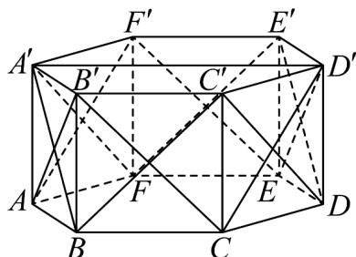

> [!faq]- 《专题04 空间中点线面关系的五大常考题型（高效培优专项训练）》官方解析
>
> > [!success]- **【答案】** 5
>
> > [!note]- **【分析】**
> > 作出辅助线，得到 $A', D', B, C$ 四点共面， $A'B, CD'$ 不是异面直线，同理得到 $EF'$ 与 $A'B$ 共面，再由 $A'B // DE'$ 和 $AB', A'F, BC'$ 与 $A'B$ 相交，得到与 $A'B$ 不是异面直线的面对角线，从而得到剩余与 $A'B$ 异面的面对角线，最后确定答案.
>
> > [!note]- **【解析】**
> > 
> >
> > 连接六个侧面的面对角线及 $A^{\prime}D^{\prime}$
> >
> > 因为六边形 $A^{\prime}B^{\prime}C^{\prime}D^{\prime}E^{\prime}F^{\prime}$ 为正六边形，所以 $A^{\prime}D^{\prime}//B^{\prime}C^{\prime}$
> >
> > 故 $A^{\prime}D^{\prime} / / BC$ ，所以 $A^{\prime},D^{\prime},B,C$ 四点共面， $A^{\prime}B,CD^{\prime}$ 不是异面直线，
> >
> > 同理可得： $EF'$ 与 $A'B$ 共面，不是异面直线，
> >
> > 而 $A^{\prime}B \parallel DE^{\prime}$ ，所以 $A^{\prime}B, DE^{\prime}$ 共面，不是异面直线，
> >
> > 又 $AB', A'F, BC'$ 与 $A'B$ 相交，所以 $AB', A'F, BC'$ 与 $A'B$ 也不是异面直线，
> >
> > 故12条面对角线中，与 $A^{\prime}B$ 不是异面直线的面对角线为 $AB^{\prime},A^{\prime}F,BC^{\prime},DE^{\prime},EF^{\prime},CD^{\prime}$
> >
> > 其余面对角线均与 $A'B$ 异面，分别为 $B'C, C'D, D'E, FE', AF'$ ，共 5 条.
> >
> > 故答案为：5
