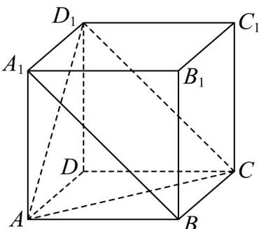

> [!faq]- 《专题04 空间中点线面关系的五大常考题型（高效培优专项训练）》官方解析
>
> > [!success]- **【答案】** B
>
> > [!note]- **【分析】**
> > 根据线线角的求法，将异面直线平移至同一平面内，求得正确答案.
>
> > [!note]- **【解析】**
> > 画出图象如下图所示：
> >
> > 
> >
> > 根据正方形的性质可知 $A_{1}B // D_{1}C$
> >
> > 所以 $\angle AD_{1}C$ 或其补角是直线 $A_{1}B$ 与 $AD_{1}$ 所成角，
> >
> > 由于三角形 $ACD_{1}$ 是等边三角形，
> >
> > 所以 $\angle AD_{1}C=\frac{\pi}{3}$ ，
> >
> > 即直线 $A_{1}B$ 与 $AD_{1}$ 所成的角的大小为 $\frac{\pi}{3}$ .
> >
> > 故选 **B**
