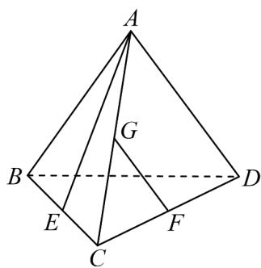
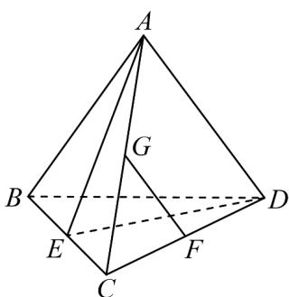

> [!faq]- 《专题04 空间中点线面关系的五大常考题型（高效培优专项训练）》官方解析
>
> > [!success]- **【答案】** 
>
> > [!note]- **【分析】**
> > 根据题目已知条件判断出异面直线 AE, FG 所成角为 $\angle EAD$ ，利用余弦定理计算 $\cos \angle EAD$ 即可.
>
> > [!note]- **【解析】**
> > 连接 DE，因为 F, G 分别为 CD, AC 的中点，所以 FG // AD
> >
> > 因异面直线所成角的范围为 $(0^{\circ},90^{\circ}]$ ，则异面直线 $AE,FG$ 所成角为 $\angle EAD$
> >
> > 设正四面体 $ABCD$ 的棱长为 $a$ ，则 $AD = a$ ， $AE = ED = \sqrt{a^2 - (\frac{a}{2})^2} = \frac{\sqrt{3}}{2} a$ ，
> >
> > 根据余弦定理， $\cos \angle EAD = \frac{AE^2 + AD^2 - ED^2}{2 \times AE \times AD} = \frac{\left(\frac{\sqrt{3}}{2}a\right)^2 + a^2 - \left(\frac{\sqrt{3}}{2}a\right)^2}{2 \times \frac{\sqrt{3}}{2}a \times a} = \frac{a^2}{\sqrt{3}a^2} = \frac{\sqrt{3}}{3}$
> >
> > 则异面直线 $AE, FG$ 所成角的余弦值为 $\frac{\sqrt{3}}{3}$ .
> >
> > 故答案为： $\frac{\sqrt{3}}{3}$
> >
> > 
