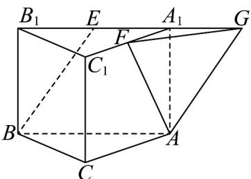
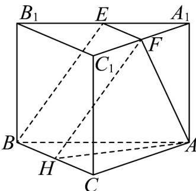

> [!faq]- 《专题04 空间中点线面关系的五大常考题型（高效培优专项训练）》官方解析
>
> > [!success]- **【答案】** $\frac{\sqrt{30}}{10}/\frac{1}{10}\sqrt{30}$
>
> > [!note]- **【分析】**
> > 通过平移 BE 至与 AF 相交，作出异面直线所成的角即可求解.
>
> > [!note]- **【解析】**
> > 解法1：如图，延长 $EA_{1}$ 至点 $G$ ，使 $EG = BA$
> >
> > 
> >
> > 因为 $ABC-A_{1}B_{1}C_{1}$ 是直三棱柱，所以 $EG \parallel BA$
> >
> > 所以四边形 $EBAG$ 是平行四边形，故 $AG \parallel BE$
> >
> > 所以 $\angle GAF$ （或其补角）即为异面直线 $BE$ 与 $AF$ 所成的角.
> >
> > 设 $BC = CA = CC_{1} = 2$ ，则 $BA = 2\sqrt{2}$
> >
> > 从而 $AG = BE = \sqrt{6}$ ， $AF = \sqrt{5}$
> >
> > 在 $\triangle A_{1}FG$ 中， $A_{1}F = 1$ ， $A_{1}G = \sqrt{2}$ ， $\angle FA_{1}G = 135^{\circ}$
> >
> > 所以 $FG = \sqrt{5}$
> >
> > 所以 $\cos\angle GAF=\frac{AG^{2}+AF^{2}-FG^{2}}{2\cdot AG\cdot AF}=\frac{\sqrt{30}}{10}$
> >
> > 解法2：如图，取 $BC$ 的中点 $H$ ，连结 $EF, FH, HA$
> >
> > 
> >
> > 由 $ABC - A_{1}B_{1}C_{1}$ 是直三棱柱得 $B_{1}C_{1}\parallel BC$ ， $B_{1}C_{1} = BC$
> >
> > 由 $E,F$ 分别是 $A_{1}B_{1}$ ， $A_{1}C_{1}$ 的中点得 $EF\| B_1C_1$ ， $EF = \frac{1}{2} B_1C_1$
> >
> > 所以 $EF \parallel BH$ ，EF = BH，
> >
> > 故四边形 BEFH 是平行四边形，所以 HF // BE
> >
> > 所以 $\angle HFA$ （或其补角）即为异面直线 $BE$ 与 $AF$ 所成的角。
> >
> > 设 $BC = CA = CC_{1} = 2$
> >
> > 则 $AF = \sqrt{5}$ ， $AH = \sqrt{5}$ ， $HF = BE = \sqrt{6}$
> >
> > 由余弦定理得 $\cos \angle HFA = \frac{\sqrt{30}}{10}$
> >
> > 故答案为： $\frac{\sqrt{30}}{10}$
