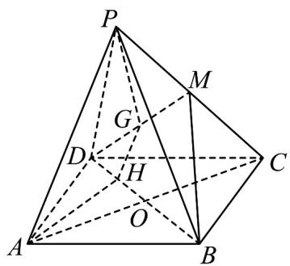

<!-- question-source:start -->
1. 如图所示，在四棱锥 $P - ABCD$ 中，底面 $ABCD$ 是平行四边形， $AC$ 与 $BD$ 交于点 $O$ ， $M$ 是 $PC$ 的中点，在 $DM$ 上取一点 $G$ ，过 $G$ 和 $AP$ 作平面交平面 $BDM$ 于 $GH$ ，求证： $AP \parallel GH$ .

<!-- question-source:end -->

![[高中/课堂同步/题库/人教A版高中数学同步讲义(2026)/02_必修第二册/第八章 立体几何初步/专题05 线面位置关系的四大常考题型（高效培优专项训练）/题型四_面面垂直考点/questions/answers/Q00069686A1.md]]
