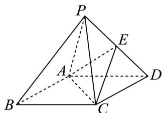

<!-- question-source:start -->
3．如图，在四棱锥 P-ABCD 中，底面 ABCD 为菱形，E 是 PD 的中点，PA=PC=AB=2，PB=PD， $\angle ABC=60^{\circ}$

(1)求证： $PB\|$ 平面 $ACE$

(2)求三棱锥 $E - ACD$ 的体积.
<!-- question-source:end -->

![[高中/课堂同步/题库/人教A版高中数学同步讲义(2026)/02_必修第二册/第八章 立体几何初步/专题05 线面位置关系的四大常考题型（高效培优专项训练）/题型四_面面垂直考点/questions/answers/Q00069688A1.md]]
