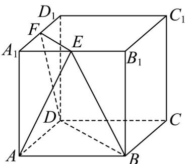

<!-- question-source:start -->
10．在棱长为1的正方体 $ABCD-A_{1}B_{1}C_{1}D_{1}$ 中，E,F分别为 $A_{1}B_{1}$ ， $A_{1}D_{1}$ 的中点.

(1)求五面体 $ABD-A_{1}EF$ 的体积；

(2)若 $P$ 在线段 $A_{1}C_{1}$ 上， $CP //$ 平面 $BDEF$ ，求 $C_1P$ 的长度.
<!-- question-source:end -->

![[高中/课堂同步/题库/人教A版高中数学同步讲义(2026)/02_必修第二册/第八章 立体几何初步/专题05 线面位置关系的四大常考题型（高效培优专项训练）/题型四_面面垂直考点/questions/answers/Q00069695A1.md]]
