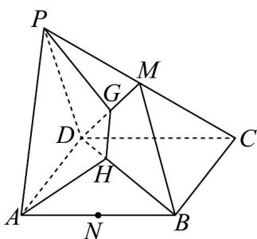

<!-- question-source:start -->
11．如图，四边形 ABCD 是平行四边形，点 P 是平面 ABCD 外一点. 已知 M ， N 分别是 PC ， AB 的中点，在 DM 上取一点 G ，过 G 和 AP 作平面交平面 BDM 于 HG.

(1)求证： $MN / /$ 平面PAD；

(2)求证： $AP / / HG$
<!-- question-source:end -->

![[高中/课堂同步/题库/人教A版高中数学同步讲义(2026)/02_必修第二册/第八章 立体几何初步/专题05 线面位置关系的四大常考题型（高效培优专项训练）/题型四_面面垂直考点/questions/answers/Q00069696A1.md]]
