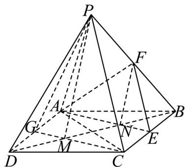

<!-- question-source:start -->
14．如图，四边形 ABCD 是平行四边形，点 E, F, G 分别为线段 BC, PB, AD 的中点.

(1)证明： $EF \parallel$ 平面 PAC；

(2)若 $AE\cap BD = N,CG\cap BD = M$ ，证明：FN//PM
<!-- question-source:end -->

![[高中/课堂同步/题库/人教A版高中数学同步讲义(2026)/02_必修第二册/第八章 立体几何初步/专题05 线面位置关系的四大常考题型（高效培优专项训练）/题型四_面面垂直考点/questions/answers/Q00069699A1.md]]
