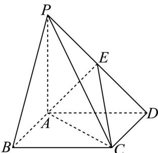

<!-- question-source:start -->
17．如图，在四棱锥 P-ABCD 中，底面 ABCD 是平行四边形，AC 交 BD 于点 O，E 是 PD 的中点．在线段 PA 上是否存在点 F，使得平面 $OEF \parallel$ 平面 PBC，若存在，请给出点 F 的位置，并证明，若不存在，请说明理由.

<!-- question-source:end -->

![[高中/课堂同步/题库/人教A版高中数学同步讲义(2026)/02_必修第二册/第八章 立体几何初步/专题05 线面位置关系的四大常考题型（高效培优专项训练）/题型四_面面垂直考点/questions/answers/Q00069702A1.md]]
