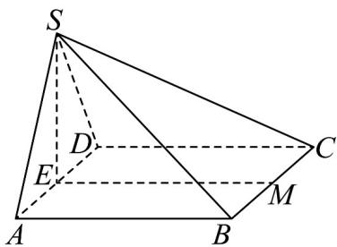

<!-- question-source:start -->
35．如图，在四棱锥 S-ABCD 中，平面 $SAD \perp$ 平面 ABCD, SA = SD = AD = 2 ，四边形 ABCD 为正方形，E, M 分别为 AD、BC 的中点.

(1)直接写出图中与 $EM$ 平行的平面；

(2)求证：平面 $SAD \perp$ 平面 $SAB$ ；

(3)在棱 $SC$ 上是否存在点 $N$ ，使得平面 $DMN \perp$ 平面 $ABCD$ ? 若存在，求三棱锥 $C - DMN$ 体积；若不存在，说明理由.
<!-- question-source:end -->

![[高中/课堂同步/题库/人教A版高中数学同步讲义(2026)/02_必修第二册/第八章 立体几何初步/专题05 线面位置关系的四大常考题型（高效培优专项训练）/题型四_面面垂直考点/questions/answers/Q00069720A1.md]]
