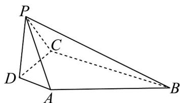

<!-- question-source:start -->
36. 如图，在四棱锥 $P - ABCD$ 中， $AD \perp$ 平面 $PCD, AD // BC, PD \perp PB$ .

(1)求证：平面 $PAD \perp$ 平面PBC；

(2)若 $AD = 1, PD = 2, CD = 3, BC = 4$ ，求直线 $AB$ 与平面 $PBC$ 所成角的正弦值.
<!-- question-source:end -->

![[高中/课堂同步/题库/人教A版高中数学同步讲义(2026)/02_必修第二册/第八章 立体几何初步/专题05 线面位置关系的四大常考题型（高效培优专项训练）/题型四_面面垂直考点/questions/answers/Q00069721A1.md]]
