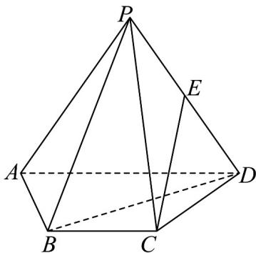

<!-- question-source:start -->
37. 如图，在四棱锥 $P - ABCD$ 中， $\triangle PAD$ 是边长为 2 的等边三角形，底面 $ABCD$ 是等腰梯形， $AD // BC, \angle BAD = 60^\circ, BC = 1, E$ 是 $PD$ 的中点.

(1)求证： $CE \parallel$ 平面 PAB；

(2)若 $AB \perp PB$ ，

(i) 求证：平面 $PBD \perp$ 平面 ABCD；

(ii) 求直线 CE 与底面 ABCD 所成角的余弦值.
<!-- question-source:end -->

![[高中/课堂同步/题库/人教A版高中数学同步讲义(2026)/02_必修第二册/第八章 立体几何初步/专题05 线面位置关系的四大常考题型（高效培优专项训练）/题型四_面面垂直考点/questions/answers/Q00069722A1.md]]
