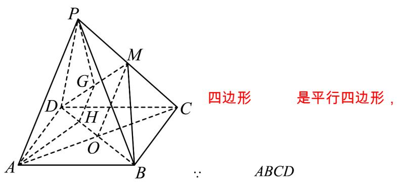

> [!faq]- 《专题05 线面位置关系的四大常考题型（高效培优专项训练）》官方解析
>
> > [!success]- **【答案】** 证明见解析
>
> > [!note]- **【分析】**
> > 先证明线面平行，由 $AP \parallel$ 平面 BDM 的性质可得 $AP \parallel GH$ .
>
> > [!note]- **【解析】**
> > 证明：如图，连接 $OM$ ：
> >
> > 
> >
> > $\therefore O$ 是 $AC$ 的中点.
> >
> > 又∵ M 是 PC 的中点，∴ AP ∥ OM .
> >
> > 又∵ $AP \not\subset$ 平面 BDM ， $OM \subset$ 平面 BDM ， ∴ $AP \parallel$ 平面 BDM .
> >
> > 又∵ $AP \subset$ 平面 APGH ，平面 APGH ∩ 平面 BDM = GH
> >
> > $\therefore AP \parallel GH.$
