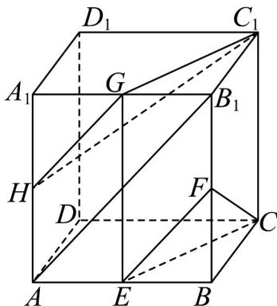

> [!faq]- 《专题05 线面位置关系的四大常考题型（高效培优专项训练）》官方解析
>
> > [!success]- **【答案】** (1)证明见解析 (2)存在， $\frac{A_{1}H}{A_{1}A}=\frac{1}{2}.$
>
> > [!note]- **【分析】**
> > （1）连接 $EG$ ，根据题意，证得四边形 $CEGC_{1}$ 是平行四边形，得到 $CE // C_{1}G$ ，结合线面平行的判定定理，即可证得 $C_{1}G //$ 平面 $CEF$ ；
> >
> > (2) 连接 $AB_{1}$ ，分别证得 $EF // AB_{1}$ 和 $GH // EF$ ，得到 $GH //$ 平面 $CEF$ ，由 (1) 知 $C_{1}G //$ 平面 $CEF$ ，证得平面 $C_{1}GH //$ 平面 $CEF$ ，即可得到答案.
>
> > [!note]- **【解析】**
> > （1）证明：如图所示，连接EG，
> >
> > 因为 $E, G$ 分别是棱 $AB, A_1B_1$ 的中点，所以 $EG // BB_1, EG = BB_1$
> >
> > 由长方体的性质，可知 $BB_{1} / / CC_{1}, BB_{1} = CC_{1}$ ，则 $EG / / CC_{1}$ 且 $EG = CC_{1}$ ，
> >
> > 所以四边形 $CEGC_{1}$ 是平行四边形，所以 $CE // C_{1}G$
> >
> > 又因为 $CE \subset$ 平面 $CEF$ ，且 $C_1G \notin$ 平面 $CEF$ ，所以 $C_1G //$ 平面 $CEF$ .
> >
> > (2) 解：取棱 $AA_{1}$ 的中点 $_{H}$ ，连接 GH, $C_{1}H$ ，平面 $C_{1}GH //$ 平面 CEF，此时 $\frac{A_{1}H}{A_{1}A} = \frac{1}{2}$ .
> >
> > 理由如下：
> >
> > 连接 $AB_{1}$ ，因为 $E, F$ 分别为棱 $AB, BB_{1}$ 的中点，所以 $EF // AB_{1}$
> >
> > 因为 $G, H$ 分别为棱 $A_{1}B_{1}, A_{1}A$ 的中点，所以 $GH // AB_{1}$ ，所以 $GH // EF$
> >
> > 因为 $EF \subset$ 平面 CEF 且 GH $\notin$ 平面 CEF ，所以 GH // 平面 CEF ，
> >
> > 由（1）可知 $C_1G //$ 平面 $CEF$ ，且 $C_1G \subset$ 平面 $C_1GH$ ， $GH \nmid$ 平面 $C_1GH$ ， $C_1G \cap GH = G$ ，所以平面 $C_1GH //$ 平面 $CEF$ ，
> >
> > 故在棱 $AA_{1}$ 上存在点 $_{H}$ ，使得平面 $C_{1}GH//$ 平面 $_{CEF}$ ，此时 $\frac{A_{1}H}{A_{1}A}=\frac{1}{2}$ .
> >
> > 
