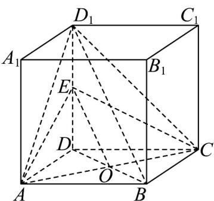

> [!faq]- 《专题05 线面位置关系的四大常考题型（高效培优专项训练）》官方解析
>
> > [!success]- **【答案】** (1)证明见解析 (2) $\frac{2}{3}$
>
> > [!note]- **【分析】**
> > （1）连接 $BD$ 交 $AC$ 于 $O$ ，连接 $OE$ ，即可得到 $OE // BD_{1}$ ，根据线面平行判断定理从而得证；
> >
> > (2) 根据正方体的性质及 $V_{D_{1}-AEC} = V_{A-D_{1}EC} = \frac{1}{3} S_{\triangle D_{1}EC} \cdot AD$ 计算可得.
>
> > [!note]- **【解析】**
> > （1）连接 $BD$ 交 $AC$ 于 $O$ ，连接 $OE$
> >
> > 在正方体 $ABCD - A_{1}B_{1}C_{1}D_{1}$ 中，O 为 BD 的中点，且 E 为 $DD_{1}$ 中点，
> >
> > 所以 $OE$ 是 $\triangle BDD_{1}$ 的中位线，即 $OE // BD_{1}$
> >
> > 又 $OE \subset$ 平面 AEC， $BD_{1} \notin$ 平面 AEC，所以 $BD_{1} //$ 平面 AEC；
> >
> > 
> >
> > (2) 正方体 $ABCD - A_{1}B_{1}C_{1}D_{1}$ 中， $AD \perp$ 平面 $DCC_{1}D_{1}$
> >
> > 所以 $V_{D_{1}-AEC}=V_{A-D_{1}EC}=\frac{1}{3}S_{\triangle D_{1}EC}\cdot AD=\frac{1}{3}\times\frac{1}{2}\times D_{1}E\times CD\times AD=\frac{1}{3}\times\frac{1}{2}\times1\times2\times2=\frac{2}{3}$
